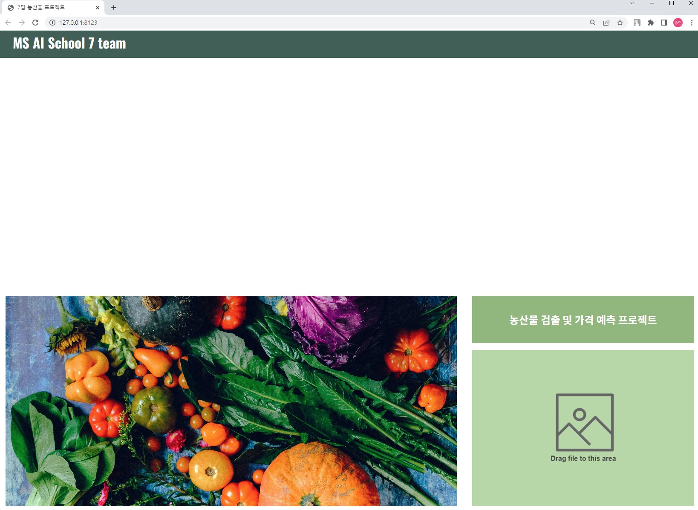
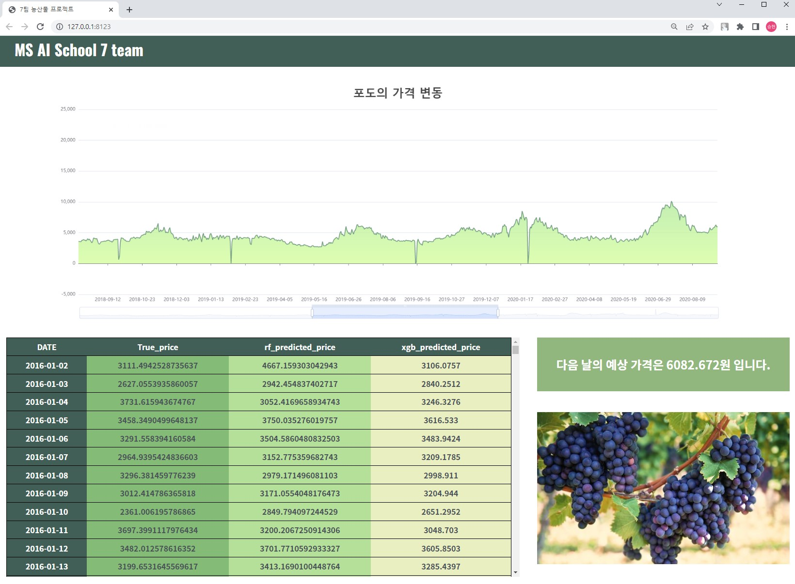

# 농산물 검출 및 가격 예측 프로젝트

본 프로젝트는 클라이언트에서 이미지를 전송하여 농산물의 종류를 검출한 후, 농산물 가격 변동에 대한 정보와 다음 날에 대한 가격을 시계열로 예측한 후 전송하는 프로젝트이다.

## Dataset
| | | | | | | | | | | | | | |
|:------:|:---:|:---:|:---:|:---:|:---:|:---:|:---:|:---:|:---:|:---:|:---:|:---:|:---:|
|배추|양파|청상추|무|토마토|마늘|대파|양배추|시금치|당근|파프리카|팽이버섯|애호박|포도|
|chinese-cabbage|onion|green-lettuce|radish|tomato|garlic|greenonion|cabbage|spinach|carrot|paprica|mushroom|young-squash|grape|

## 시스템 구성도
(작성예정)

## 프로젝트 구현 이미지

