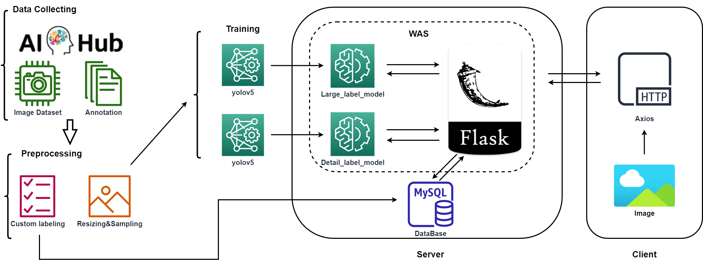

# 편의점 상품(음식) 검출 프로젝트

본 프로젝트는 Yolov5를 이용하여 편의점 상품을 검출하는 프로젝트입니다.  
해당 데이터는 아래의 링크에서 다운받아 사용하였습니다.  
링크:  [https://www.aihub.or.kr/aihubdata/data/view.do?currMenu=115&topMenu=100&aihubDataSe=realm&dataSetSn=64](https://www.aihub.or.kr/aihubdata/data/view.do?currMenu=115&topMenu=100&aihubDataSe=realm&dataSetSn=64)

## Dataset

총 아래와 같이 9개의 라벨을 선택하여 학습하였습니다.

| | | | | | | | | |
|:------:|:---:|:---:|:---:|:---:|:---:|:---:|:---:|:---:| 
|과자|디저트|면류|상온HMR|유제품|음료|주류|커피차|통조림/안주|
| | | |

본 프로젝트는 좀 더 자세한 이미지 검출을 위해 총 2개의 모델을 사용하여 결과를 도출합니다.  
(한 개의 모델 사용 시 라벨이 5416개로 정확도가 현저히 낮아집니다.)  
 
정확한 모델별 라벨은 labe_sql 폴더에 product_label_table.sql에서 확인 가능합니다.

## 시스템 구성도
