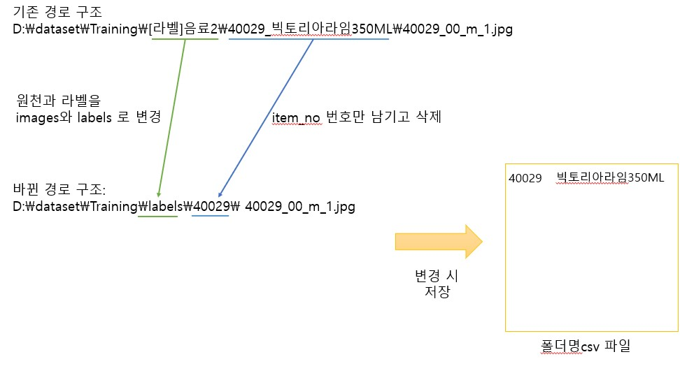

# 편의점 상품(음식) 검출 프로젝트

본 프로젝트는 Yolov5를 이용하여 편의점 상품을 검출하는 프로젝트입니다.  
해당 데이터는 아래의 링크에서 다운받아 사용하였습니다.  
링크: [https://www.aihub.or.kr/aihubdata/data/view.do?currMenu=115&topMenu=100&aihubDataSe=realm&dataSetSn=64](https://www.aihub.or.kr/aihubdata/data/view.do?currMenu=115&topMenu=100&aihubDataSe=realm&dataSetSn=64)

## Dataset

총 아래와 같이 9개의 라벨을 선택하여 학습하였다.

| | | | | | | | | |
|:------:|:---:|:---:|:---:|:---:|:---:|:---:|:---:|:---:| 
|과자|디저트|면류|상온HMR|유제품|음료|주류|커피차|통조림/안주|
| | | |

## 프로젝트 실행과정

1. 폴더명 수정(__rename_folder.py__ 사용) 
2. 이미지 사이즈를 996*996으로 resizeing(__resizing_img.py__ 사용)